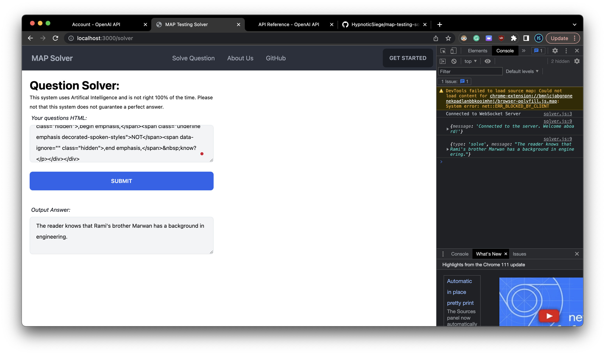

# MAP Testing Solver
 A tool to help you solve MAP Testing problems w/ GPT 3.5.

## About
MAP Testing is an online platform for educators and schools to test a student's benchmarks in mutliple different subjects like math and English in their respective levels. MAP auto adjusts to your responses. This tool is meant to help students solve problems on the MAP Testing platform.

## How to use
1. Install and run the program (instructions below; cloud-hosted version coming soon)
2. Click the "Solve Question".
3. Copy and paste the question into the text box on top. (You'll need to copy the `supplementalContentCell` div and the `prompt` cell into the text box)
4. Click "Submit".
5. Wait for the answer to appear in the text box below.
6. Woo! You're done!

## Installation
1. Install Node JS (https://nodejs.org/en/download/)
2. Download the repository
3. Open a terminal in the repository folder
4. Run `npm install`
5. Run `npm build`
6. Run `npm start`
7. Open a browser and go to `localhost:3000`
8. You're done!

## Roadmap
- [x] Add account creation and login (DB already exists and is connected)
- [x] Add a way to save questions and answers/cache them
- [x] Add a way to view saved questions and answers
- [x] Billing system w/ Stripe ($10 per test; lasts a week)

## Contributing
If you want to contribute to this project, please fork the repository and make a pull request. It will be reviewed and merged depending on the quality of the code and the usefulness of the feature.